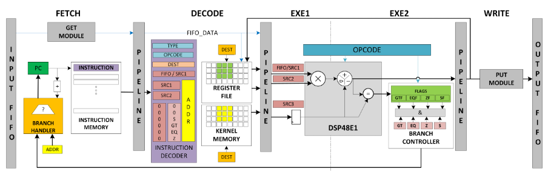

# Image Processing Processor (IPPro)

## Important References

[1] F. Siddiqui, S. Amiri, U. Minhas, "[FPGA-Based Processor Acceleration for Image Processing Applications](https://www.mdpi.com/2313-433X/5/1/16)" in Journal of Imaging 2019, 5, 16.

[2] F. Siddiqui, M. Russell, B. Bardak, R. Woods and K. Rafferty, "[IPPro: FPGA based image processing processor](https://ieeexplore.ieee.org/abstract/document/6986057)" in IEEE Workshop on Signal Processing Systems (SiPS), Belfast, UK, 2014, pp. 1-6.

[3] M. Amiri, F. Siddiqui, C. Kelly, et al. "[FPGA-Based Soft-Core Processors for Image Processing Applications](https://link.springer.com/article/10.1007/s11265-016-1185-7)" in Journal of Signal Processing Systems, 87, 139–156 (2017).

## Introduction

The IPPro is a 16-bit signed fixed-point, five-stage balanced pipelined RISC architecture that exploits the DSP48E1 features and provides balance among performance, latency and efficient resource utilization. The architecture is designed to support mapping of dataflow graphs which allows streaming of data into the processor datapath through blocking input/output FIFOs as shown in Figure 1.

The IPPro datapath consists of:
+ Instruction memory (IM) (512x32) to store the dataflow actor functional description in the form of IPPro program code.
+ Register file (RF) (32x16) to map fine and coarse-grained dataflow actors by storing intermediate results and provide random access to a stream of tokens or window of pixels stored inside the RF, e.g. 3x3, 3x4, 4x4 etc.
+ Kernel memory (KM) (32x16) to save the parameters that are reusable such as filter coefficients and constant values.
+ The blocking input/output FIFOs to buffer data tokens between a producer and a consumer to realise pipelined processing stages.

*Figure 1: Block diagram of IPPro Datapath*

## Instruction Set Architecture (ISA)

IPPro has a 32-bit instruction set architecture. Figure 2 shows the simplified IPPro frame structure where RA, RB, RC, RD and Kn represents 5-bit address fields to point a location in RF or KM. RA, RB, RC, Kn are source registers while RD is a destination register. The 5-bit OPCODE field represents a unique IPPro instruction. The 2-bit INSTR_TYPE field differentiates between supported addressing modes listed in Figure 3.

*Figure 2: IPPro instruction frame structure*

*Figure 3: IPPro supported addressing modes*

## Pipelined Stream Processing

The IPPro datapath is a five-stage pipeline soft-core processor composed of fetch, decode, execute#1 (EXE1), execute#2 (EXE2) and write-back (WB) stages as shown in Figure 1. It starts execution by fetching the instruction from the instruction memory, the instruction decoder decodes the fetched instruction and generates required control signals to control the datapath. During this stage based on addressing mode (Figure 3), IPPro read data operands either from input FIFO, RF or KM and stores into the pipeline registers and forwards to DSP48E1 block in EXE1 stage. The DSP48E1 is dynamically reconfigured on a cycle-to-cycle basis by ID. The configuration of DSP48E1 control signals to implement IPPro instructions (for details see Appendix B Table B.1). The DSP48E1 processes the data operands and store the results back to the register file in WB stage. Both EXE1 and EXE2 are DSP48E1 internal pipeline stages. The GET and PUSH modules shown in Figure 4.6 makes sure that input/output FIFOs are not empty/full. If any of the conditions persist, the IPPro stop processing and waits until both input and output FIFO have enough space to store the tokens.

## Implementation Results

IPPro is a soft-core processor architecture has written in Verilog, synthesised and implemented using Xilinx Vivado Design Suite v2015.2. Figure 4 reports the implementation results obtained using tool’s default settings. The implementation results show that IPPro consumes < 1% of Kintex-7 (ZC706) FPGA resources and delivers 337 MIPS while maintaining BRAM/DSP ratio equal to unity. The IPPro design has ported to various FPGA fabrics to analyse the potential performance, by implementing it on widely available Xilinx development boards used by research community which are ZedBoard (XC7Z020CLG484-1), ZC706 (XC7Z045FFG900-2) and VC707 (XC7VX485T-2). Figure 4 shows the maximum possible frequency f Max on the selected Xilinx development boards.

  
*Figure 4: IPPro implementation results on selected Xilinx development boards.*
